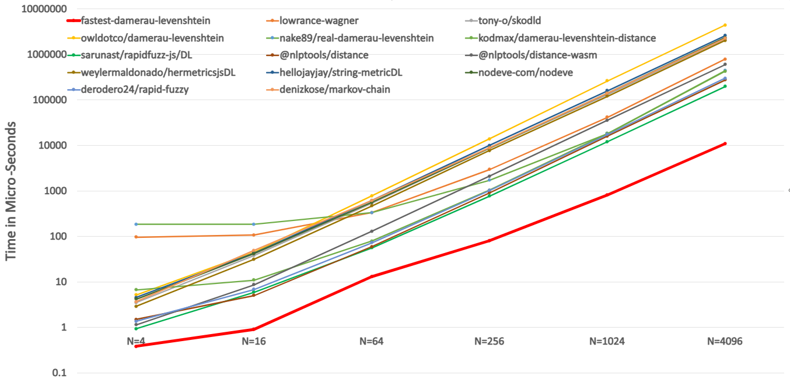
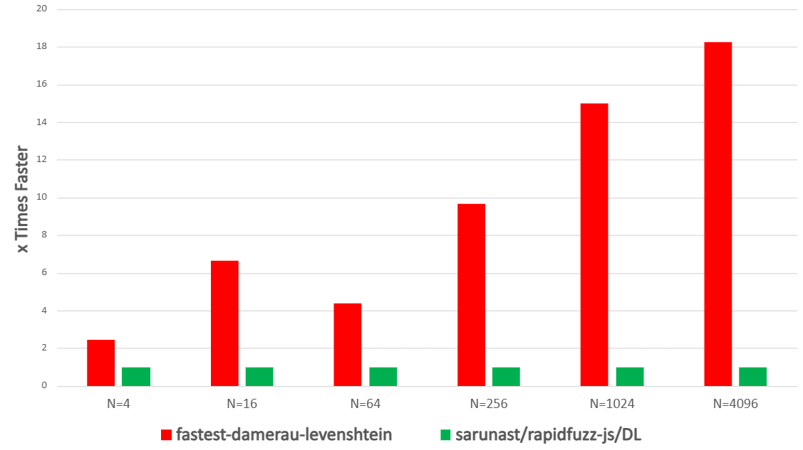
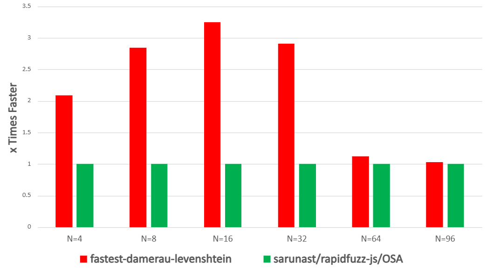

# fastest-damerau-levenshtein 🚀

> Fastest JS/TS implementation of the **unrestricted** Damerau-Levenshtein distance.

[](https://www.npmjs.com/package/fastest-damerau-levenshtein)
[](./LICENSE)
[](https://www.typescriptlang.org/)
[](https://github.com/nadalaba/fastest-damerau-levenshtein/actions)


The unrestricted Damerau-Levenshtein distance measures the minimum number of edits (insertion, deletion, substitution, and transposition) needed to transform one string into another. Unlike the restricted variant (Optimal String Alignment), the unrestricted form is a true metric that satisfies the triangle inequality.

## Table of Contents

- [Features](#features)
- [Installation](#installation)
- [API](#api)
- [CLI](#cli)
- [Why Unrestricted Damerau-Levenshtein?](#why-unrestricted-damerau-levenshtein)
- [Performance](#performance)
- [License](#license)

## Features

- **Unrestricted Damerau-Levenshtein metric** - True metric distance (satisfies triangle inequality)
- **Unicode support** - Correctly handles multi-byte characters (emoji counted as 1 character: `'🤣'` to `'😡'` = 1)
- **ESM & CJS** - Works with both ES modules and CommonJS imports
- **Distance & similarity** - Returns both raw distance and normalized similarity [0-1]
- **Edit sequence** - Optionally outputs the sequence of edits to reconstruct one string from another
- **Batch operations** - Fast closest-string selection from a list
- **Zero dependencies** - Lightweight, fast implementation

## Installation

```bash
npm install fastest-damerau-levenshtein
```

or with pnpm:

```bash
pnpm add fastest-damerau-levenshtein
```

## API

### `compare(pattern: string, text: string, options?: DistanceOptions)`

Calculates the unrestricted Damerau-Levenshtein distance and similarity between two strings.

**Returns:** `{ distance: number; similarity: number; editSequence?: string }`

#### Basic Usage (CommonJS)

```js
const { compare } = require("fastest-damerau-levenshtein");

const result = compare("fast", "faster");
console.log(result);
// => { distance: 2, similarity: 0.666666666666667 }
```

#### Basic Usage (ES Modules)

```js
import { compare } from "fastest-damerau-levenshtein";

const result = compare("fast", "faster");
console.log(result);
// => { distance: 2, similarity: 0.666666666666667 }
```

#### With Edit Sequence

The edit sequence is a string where each character represents an edit operation:

- `i` = insertion
- `d` = deletion
- `s` = substitution
- `t` = transposition
- `e` = keep character as-is

```js
const result = compare("abc", "ca", { withEditSequence: true });
console.log(result);
// => {
//   distance: 2,
//   similarity: 0.333333333333333,
//   editSequence: "tdt"
// }

// Explanation: delete 'b', transpose 'a' and 'c'
```

Another example:

```js
const result = compare("kitten", "sitting", { withEditSequence: true });
console.log(result);
// => {
//   distance: 3,
//   similarity: 0.571428571428571,
//   editSequence: "seeesei"
// }

// Explanation: substitute 'k' -> 's', keep 'itt',
//  substitute 'e' -> 'i', keep 'n', insert 'g'
```

See [core.ts#`editString()`](/dev/src/test/core.ts#editString) for how to reconstruct a string from edit sequences.

### `closest(pattern: string, list: string[], options?: DistanceOptions)`

Finds the string from the list with the lowest Damerau-Levenshtein distance from the pattern string. Optimized for batch comparisons.

**Returns:** `{ text: string | null; index: number; distance: number; similarity: number; editSequence?: string }`

```js
import { closest } from "fastest-damerau-levenshtein";

const result = closest("fast", ["slow", "faster", "fastest"]);
console.log(result);
// => { text: "faster", index: 1, distance: 2, similarity: 0.666666666666667 }
```

## CLI

Try the package without installing using the included CLI:

```bash
npx fastest-damerau-levenshtein <s1> <s2> [options]
```

Example:

```bash
npx fastest-damerau-levenshtein fast faster
# => 2

pnpm dlx fastest-damerau-levenshtein fast faster --similarity
# => 0.666666666666667

npx fastest-damerau-levenshtein fast faster --distance --similarity
# => Distance   : 2
# => Similarity : 0.666666666666667

pnpm dlx fastest-damerau-levenshtein fast "slow" "faster" "fastest"
# => faster
```

## Why Unrestricted Damerau-Levenshtein?

The Damerau-Levenshtein distance allows four edit operations:

1. Insertion
2. Deletion
3. Substitution
4. Transposition (swapping two adjacent characters)

The **unrestricted** variant is a true metric, meaning it satisfies the triangle inequality: `d(A,C) ≤ d(A,B) + d(B,C)`. It permits transposition around deleted symbols or insertion between transposed symbols.

The restricted variant (Optimal String Alignment / OSA) is more commonly implemented but is not a true metric. It only allows transposition if symbols were adjacent in both strings:

- **Restricted:** `d('abc', 'ca') = 3 > d('abc', 'ac') + d('ac', 'ca') = 2` (after deleting 'b', transposition 'ac' -> 'ca' is not allowed)
- **Unrestricted:** `d('abc', 'ca') = 2 ≤ d('abc', 'ac') + d('ac', 'ca') = 2` (deleting 'b', then transposing 'ac' -> 'ca' is allowed)

This implementation uses the unrestricted form for true metric properties.

## Performance

Benchmarks using [mitata](https://github.com/evanwashere/mitata) show `fastest-damerau-levenshtein` outperforms all other implementations.

**Unrestricted implementations:** For strings 4-4096 characters, `fastest-damerau-levenshtein`'s time of iteration (bold red line) is much lower than every other library (lower is better).



`fastest-damerau-levenshtein` (red bars) is 2.44x-18.26x faster than the next best library (higher is better).



**All implementations (restricted + unrestricted):** Fastest for strings under 100 characters; 1.03x-2.09x faster than the next best library overall (higher is better). _Note: This comparison mixes unrestricted and restricted implementations (which requires less computational work), so it's not an apples-to-apples comparison; we included it just for fun._



See detailed results: **[unrestricted](./dev/src/bench/results/bench-unrestricted.md)**, _[raw](./dev/src/bench/results/bench-unrestricted.txt)_ **| [all implementations](./dev/src/bench/results/bench-all.md)**, _[raw](./dev/src/bench/results/bench-restricted.txt)_

#### Test Environment

- **CPU:** Intel(R) Core(TM) i7-7500U CPU @ 2.70GHz (~3.06 GHz)
- **Runtime:** Node 26.7.0 (x64-win32)

## License

[MIT](/LICENSE) © 2026 Nad Alaba
